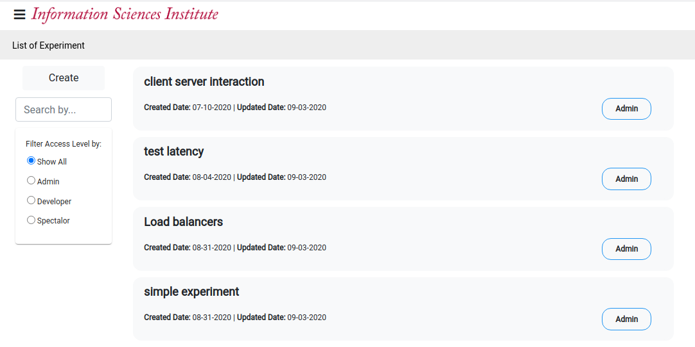
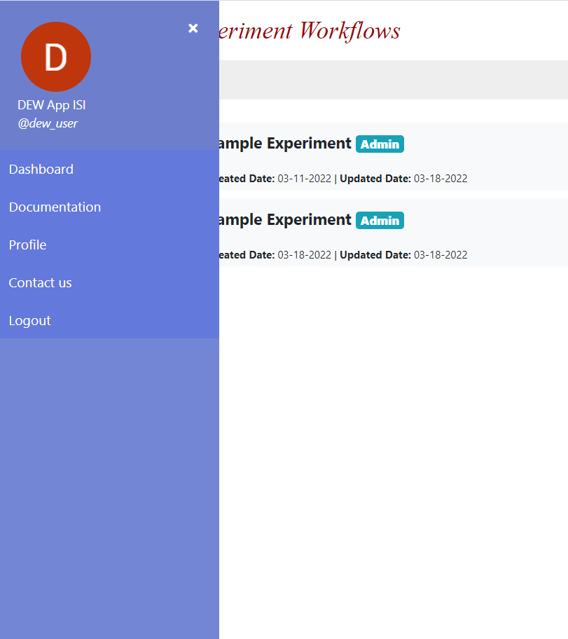
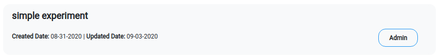
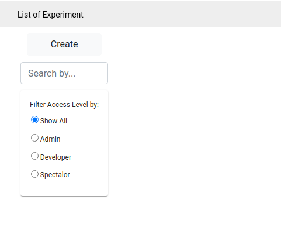

# Dashboard

* The dashboard provides a list of experiments; and options to create a new experiment, edit an existing experiment, or logout. 

    The image below depicts the main page upon successfully logging into the system.
    
    

* Clicking on the menu bar (≡) displays your name, profile picture, and the following menu options - `Dashboard`, `Documentation`, `Profile`, `Contact Us`, and `Logout`. The functionality of each menu option is described below:
    * `Dashboard` - Displays the Dashboard Page
    * `Documentation` - Displays the Documentation Page
    * `Profile` - Displays the Profile Page
    * `Contact Us` - Displays the Contact Us Page
    * `Logout` - Logout from your current DEW session
    * Clicking on the close button closes the menu bar.
      
       

* Click on an experiment to open the experiment page. Each experiment list item contains the name, creation date, last updated date, and the role you have in the experiment.    
The list of possible roles are:
    * **Admin** - Access to edit and manage access for the experiment. This is the default role assigned to the creator on creating a new experiment.
    * **Developer** - Access to edit the experiment, but is not allowed to manage users and roles for the experiment.
    * **Spectator** - Read only access to the experiment.   
* You can filter the experiments by using the filter options in the left panel of the page.    
* Clicking on the `Create` button allows you to create a new experiment.   
* You will be redirected to the experiment page on either clicking on an experiment, or on clicking the `Create` button.  
