# Experiment page

## General Layout of the Page
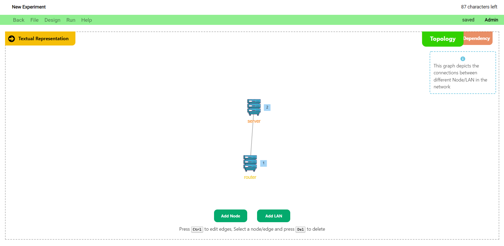

The experiment page is divided into 2 sections:

* Experiment Definition Section
* Visual Representation Section
  
The **Experiment Definition Section** is comprised of 3 sub-sections:

* Scenario
* Constraint
* Bindings
   
The **Scenario** section is used to define the actions and triggers of the experiment.

The **Constraint** section is used to define the topology structure of the experiment.

The **Bindings** section is used to bind the actions defined in the scenario to _actual computer commands_.

The **Visual Representation Section** depicts two kinds of graphs:

* The Network Topology
* The Dependency Graph

The **Network Topology** is used to depict the nodes of the nodes, and the connections that exist between them.

The **Dependency Graph** is used to depict the actions of the experiment, and the dependencies that exist between these actions.

A few general views of the page and its various components are shown below.

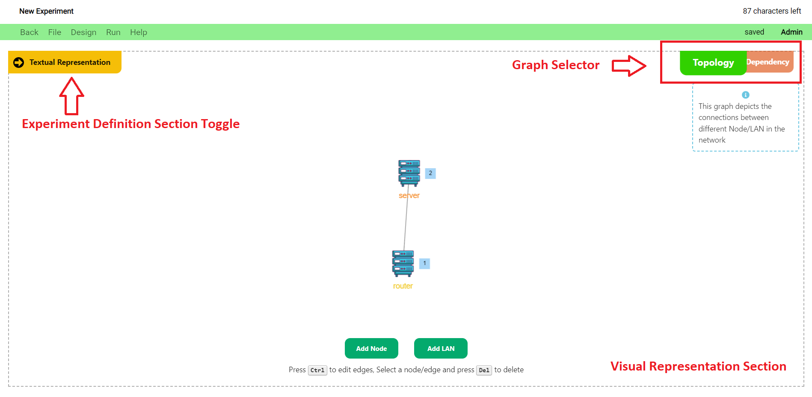

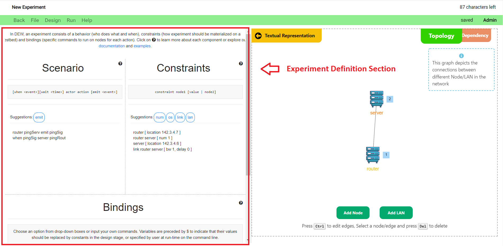


## Navigating the Page

* The initial page that opens once you create/open an experiment depicts the network topology of the experiment.
* You can click on the `Graph Selector` to toggle between the **topology network** and the **dependency graph** views.
* You can click on the `Experiment Definition Section Toggle` to toggle the **Experiment Definition Section** view.

## Experiment Name
* The name of the experiment is displayed on the top left corner of the page.
* To edit the name, click on the name and update the text. (just like Google docs)
* The name can be a maximum of 101 characters. The number of characters remaining is shown to the right of the name. <br><br> 


## Menu Bar
* The menu bar is colored green when the experiment does not contain any unsaved changes.
 
* It is colored grey if the experiment contains unsaved changes. The status is also shown next to the access level to the right.

* Your level of access with the experiment is displayed towards the extreme right.
  <br><br>
    The various buttons and their functions are as follows:

    ### Back button
    * Click on the back button to go to the dashboard. Alternatively, you can use the back button in the browser.
    
    <br><br>
    ### File menu
    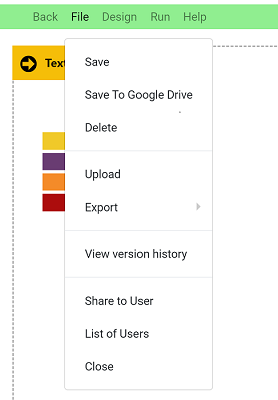<br><br>

    * This menu contains a number of file related operations. They are:

        #### Save
        * Clicking on save will save the current experiment to the database.
        <br><br>
        #### Save to Google Drive
        * This button allows you to save the experiment to Google Drive. The experiment is saved in the DEW format.
        * The user will have a top level directory called “Distributed Experiment Workflows” in their Google Drive. 
        * Inside the top level directory, we have folders created for each experiment.
        * Files relevant to the experiment will be contained in the respective experiment folders.
        * For example, if we have an experiment named "test", the DEW file will be located at `MyDrive > Distributed Experiment Workflows > test > test.dew`.
        <br><br>
        #### Delete
        * Deletes the experiment in the DEW portal. This is a **non-recoverable** action. But, the experiment will still remain on your Google Drive, if you have saved it there.
        <br><br>
        #### Version history
        * View the changes made previously to the experiment. 
        * To revert to a particular version, click on the revert button. <br><br>
        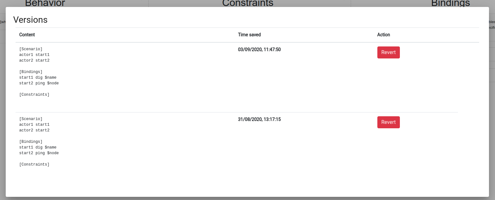
        <br><br>
        #### Share to User
        * Share the experiment with another DEW user for access. To learn more about sharing and access levels, visit the [Sharing and Collaboration page](./sharing_and_collaboration.md).<br><br>
        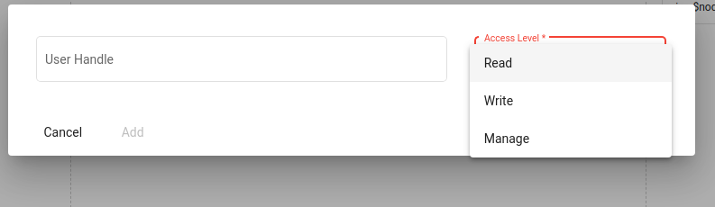
        <br><br>
        #### List of users
        * View and manage the list of users who can access the experiment. To learn more about sharing and access levels, visit [Sharing and Collaboration page](./sharing_and_collaboration.md).
        <br><br>
        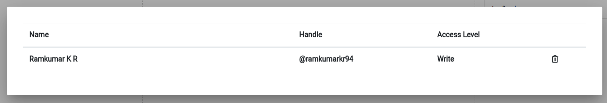
        <br><br>
        #### Close
        * Close the experiment and go back to the dashboard.
        
    <br><br>
    

    _Note: If the user has not saved the file, the file menu would have a restricted set of options as shown below._
    <br><br>
    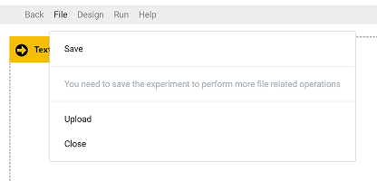
        <br><br>   
    #### _Save_

    * _This menu option is used to save the experiment to the database. Other file operations cannot be performed until the user has saved the experiment._
    <br><br>
    ### Input

    This menu option allows the user to upload an experiment saved locally in the DEW format or as a Bash script. We hope to support more experiment formats in the near future.
    <br><br>
    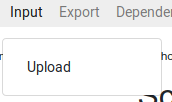
    <br><br> 
    #### Upload
    Upload DEW files to load the experiment. For example, the DEW file saved in Google Drive can be used for upload.

    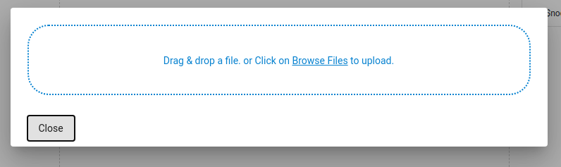
    
    <br><br>
    ### Export
    
    This menu is used to export the experiment to different formats.

    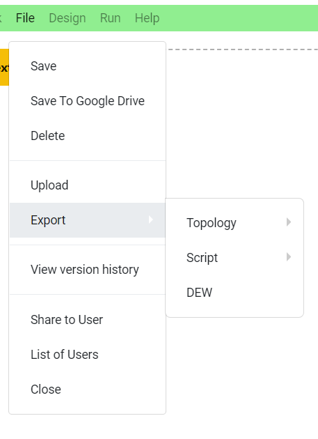<br>

    
    #### Topology
    This option enables you to export the DEW experiment to various other _topology_ representation formats. The currently supported _topology_ export formats are described below.

    * **NS File**
        * Export and download the topology of the DEW experiment as a _NS_ file.
    <br><br>
    * **MergeTB File**
        * Export and download the topology of the DEW experiment as a _MergeTB_ file.
    <br><br>
    #### Scripts
    This option enables you to export the DEW experiment to various other _script_ representation formats. The currently supported _script_ export formats are described below.
    
    * **BASH File**
        * Export and download the Bash Script(s) representation of the DEW experiment as a _zip_ file. If you choose to run the scripts locally, running the script without any arguments will display a help message mentioning the input parameters you need to specify.
    <br><br>
    #### DEW
    This option enables you to export the _DEW_ representation of the experiment as a _txt_ file. This file can shared and uploaded to other DEW experiments too.
    

## Graph Views and Manipulation

As mentioned previously in the document, the _Visual Representation Section_ comprises of the **Network Topology Graph** and the **Dependency Graph**. The steps to create and manipulate the graphs are shown below:

* ### Network Topology Graph
    The Network Topology Graph depicts the experiment nodes and the connections that exist between these nodes. 
    * #### Graph Creation and Manipulation
        * Switch to the `Network Topology Network View` by clicking on the **Topology Button** in the _Graph Selector_ bar.
        * You can add nodes to the network by clicking on the `Add Node` button on the bottom portion of the screen. Nodes are represented as _server icons_ in the graph.
        * You can add a LAN to the network by clicking on the `Add LAN` button on the bottom portion of the screen. LANS are represented as black dots in the graph.
        * You can add links between the nodes by clicking and holding `Ctrl + Left Mouse Button` between the 2 nodes that need to be linked. Links are represented as black lines in the graph.
        * The `Action Number` towards the side of the node icon denotes the _action sequence numbers_ of the actions associated with the actors (nodes).
        * The network topology components and their symbols are shown below.<br><br>
        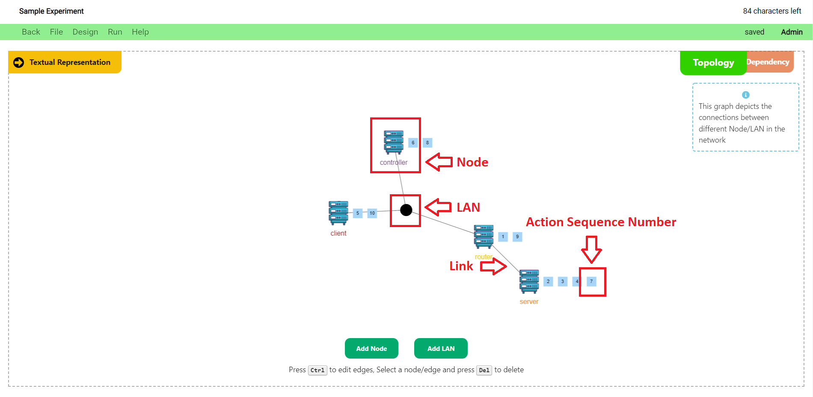<br><br>
        * You can define the parameters of a network node such as the **Operating System**, **IP Address/Location**, **Number of Nodes**, and **Hardware Type** by clicking on a node and modifying the fields in the popup that displays on the top-right portion of the screen.
        * You can also define the parameters of a link/LAN such as the **Bandwidth** and **Delay** by clicking on the link/LAN and modifying the fields in the popup that displays on the top-right portion of the screen.
        * The Topology Node/Link Parameter Definition popup is shown below.<br><br>
        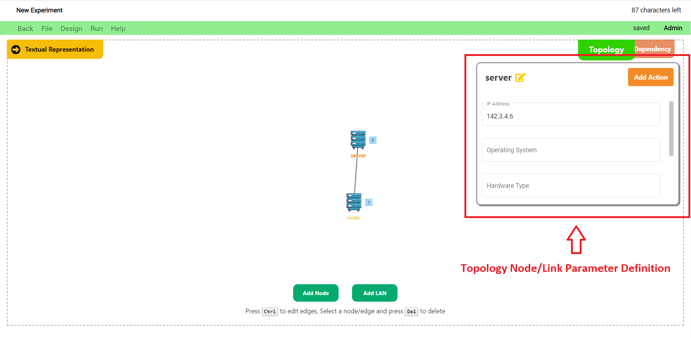<br><br>
        * Any changes made to the network topology graph also reflects in the scenario and constraints in the _Experiment Definition Section_ of the page.
        <br><br>
* ### Dependency Graph
    In order to understand the experiment better, we have a graph view which displays the experiment as a flowchart of actions. The nodes denote actions, with the color of the node denoting the actor that performs the given action. Edges denote a dependency, where one action results in an event and a following action waits for that event. You can create new edges (dependencies) between nodes, or delete existing edges (dependencies). As you modify the dependency graph, the modifications are propagated to the Experiment view.
    The Dependency Graph depicts the actions of the experiment, and the dependencies that exist between the actions.
    * #### Graph Creation and Manipulation
        * Switch to the `Dependency Graph View` by clicking on the **Dependency Button** in the _Graph Selector_ bar.
        * You can add actions to the dependency graph by clicking on the `Add Action` button in the bottom portion of the screen. This will open up the **Add Action Popup**.
        * _Note that you can access the same **Add Action Popup** when you click on the `Add Action` button in the **Topology Node/Link Parameter Definition** popup that shows up when you click on a node in the network topology graph._
        * Using the _Add Action Popup_, you can create an action by assigning an **action name**, **trigger event**, **emit event**, **wait time**, **action binding**, and **event binding**; and then clicking on the `Add Action` button.
        * You can also **edit an action** by clicking on the `Edit Action` button that shows up in the bottom portion of the screen when you click on the respective action.
        * The _Add Action Popup_ is shown in the image below.<br><br>
        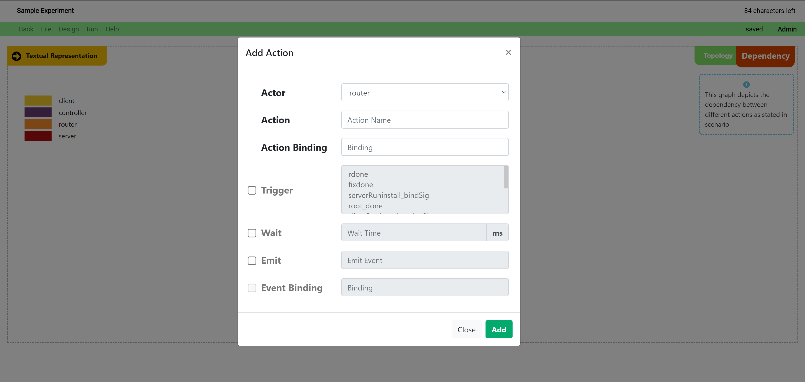<br><br>
        * The `Action Number` towards the side of the action icon denotes the _action sequence numbers_ of the actions associated with the actors (nodes in the graph legend).
        * Any changes made to the dependency graph also reflects in the scenario and bindings in the _Experiment Definition Section_ of the page.
        * The dependency graph components and their symbols are shown below.<br><br>
        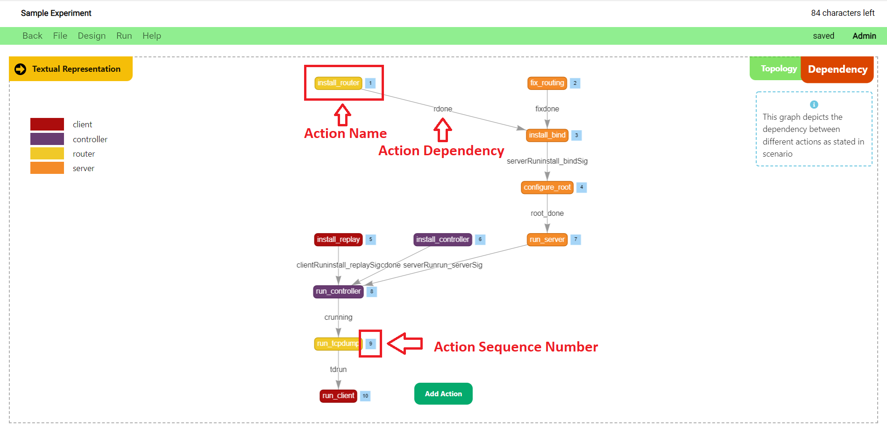<br><br>


<!-- ## Dependency graph


* In order to understand the experiment better, we have a graph view which displays the experiment as a flowchart of actions. The nodes denote actions, with the color of the node denoting the actor that performs the given action. Edges denote a dependency, where one action results in an event and a following action waits for that event. You can create new edges (dependencies) between nodes or delete existing edges (dependencies). As you modify the dependency graph the modifications are propagated to the Experiment view. 
* The graph viewer also supports editing edges.
* To access the graph, click on the **Dependency graph** option in the menu bar.
* To go back to the experiment, click on the **Experiment** option in the menu bar.

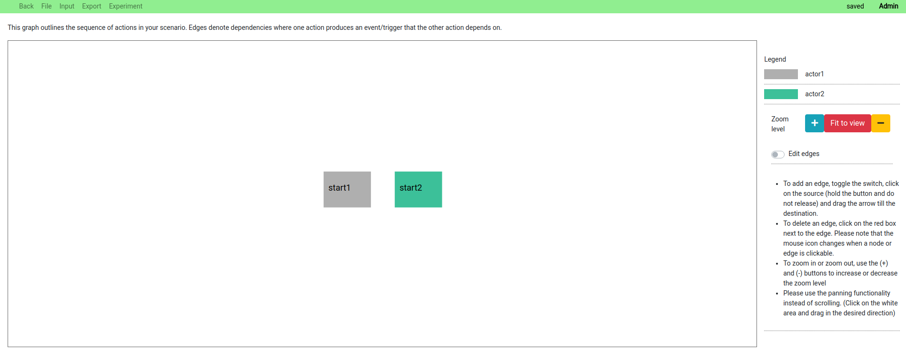


### Editing edges
* To add an edge, toggle the switch, click on the source (hold the button and do not release) and drag the arrow till the destination.

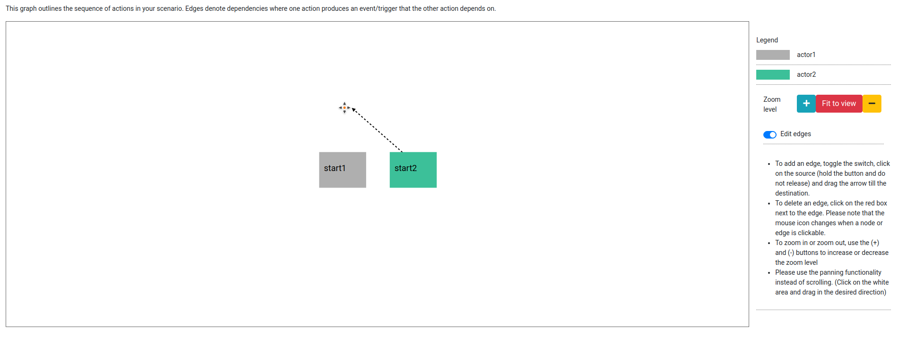

* To delete an edge, click on the red box next to the edge. Please note that the mouse icon changes when a node or edge is clickable.

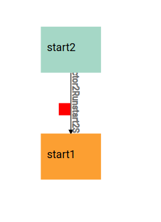

### Zoom and scroll
* To zoom in or zoom out, use the (+) and (-) buttons to increase or decrease the zoom level
* Please use the panning functionality instead of scrolling. (Click on the white area and drag in the desired direction) -->

## Scenario, Constraints, and Bindings

 * In DEW, an experiment consists of a **Scenario** (who does what, and when), **Constraints** (how should the experiment be materialized on a testbed), and **Bindings** (specific commands to run on the nodes). 

### Scenario

* _Scenario_ defines the actions to be executed by actors during the experiment. You can think of an actor as a node in an experiment, or as many nodes that perform the same set of actions. You can think of an action as one or more commands executed on a node in an experiment. An action can result in an event (we say that it emits an event) and a later action will occur only when that event is generated. For example you may want to install an Apache application on the “server” node, and then generate traffic to it from a “client” node when the installation is completed. Two actions that are not connected by emit-when rules occur independently and in parallel. Please explore our [examples](/examples) to get familiar with some common uses of the DEW language.
* _Scenario_ statements are of the form
```
[when <event>][wait <time>] actor action [emit <event>]
```

* For example, if you want to express the following behavior **"A pings B, after that B waits 5 sec and pings A"** you would write:
```
A start_ping1 emit ping1_done
when ping1_done wait 5 B start_ping2
```
Conversely if you wanted **A and B to ping each other in parallel** you would write:
```
A start_ping1
B start_ping2
```
Names of actors will eventually correspond to names of nodes in your experiments. Names of actions are chosen by you. You will get to define what they mean in the _Bindings_ section.

* As you start typing, there will be auto-suggestions displayed near the top of the text area.
* Press `tab` to use the first auto suggested word. It will append the word at the cursor location in the textarea.
* There will also be a sentence suggestion displayed along with suggested text. This will help you write the next word or phrase. 

### Constraints

* The _Constraints_ section helps the user define _Constraints_ with regards to the topology of the experiment, as the experiment will be materialized on a testbed.
* You can find the list of _Constraints_ and the general syntax of the _Constraints_ in the `Basics` section of the documentation.
* As you start typing, you will find the auto-suggestion displayed near the top of the text area.
* Press `tab` to use the first auto suggested word. It will append the word at the cursor location in the textarea.
* There will also be a sentence suggestion displayed along with suggested text. This will help you write the next word or phrase. 

### Bindings

* The _Bindings_ section defines the commands to be executed on testbed nodes for the given action or event in your experiment.
* Choose an option from the drop-down boxes, or input your own commands. Variables are preceded by `$` to indicate that their values should be replaced by constants in the design stage, or specified by user at run-time on the command line.
* For example:
```
install_iperf apt-get install iperf -y
run_tcpdump tcpdump -i expIP -w $file
install_flooder /scripts/common/install_flooder.sh
start_server iperf -s 
```
* As you start typing the _Scenario_ above, the _Bindings_ area will be populated with the terms which require definition in order to execute the experiment. 

<!--TODO: //Check with Dr. Mirkovic about this.// We have provided some suggestions for _action and event Bindings_. Please look at the [binding suggestions](/binding_suggestions) page for more information. -->


## Tutorials
View video tutorials on using the experiment page below: <br>
<iframe width="560" height="315" src="https://www.youtube.com/embed/xljmWCC339M" frameborder="0" allow="accelerometer; autoplay; clipboard-write; encrypted-media; gyroscope; picture-in-picture" allowfullscreen></iframe>
<br>
<iframe width="560" height="315" src="https://www.youtube.com/embed/Q8b8NjjvI08" frameborder="0" allow="accelerometer; autoplay; clipboard-write; encrypted-media; gyroscope; picture-in-picture" allowfullscreen></iframe>
<br>
<iframe width="560" height="315" src="https://www.youtube.com/embed/-WynHhWOHXs" frameborder="0" allow="accelerometer; autoplay; clipboard-write; encrypted-media; gyroscope; picture-in-picture" allowfullscreen></iframe>
<br>