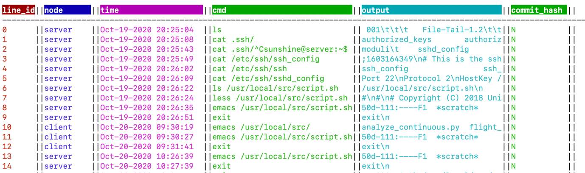

# From Testbed to DEW

Some users may develop their experiment manually and then desire to create scripts to run it automatically.
Since experiment development may span several weeks or even months it is challenging for a user to recall
what worked and when, to assemble a robust script. We have developed tools to aid in this process.

## Terminal input and output capture

If you use the image `Ubuntu-DEW` in your experiment all your terminal input and the first 500 characters of
your terminal output, along with the time, the current directory and the current user, will be logged
in your project directory (in `/proj/YourProject/logs/output_csv`).

## Automated file versioning

If you use the image `Ubuntu-DEW` in your experiment we can save all changes you make to files on your nodes
in a git repository. This can be very useful if e.g., you recall that some application you have spent days to
configure worked fine last Tuesday, but you have since changed its configuration and you cannot recall what
exactly you have changed.

To use this fuctionality you need to take the following steps (only once per project): (1) Create the folder named `upload_modified_files` in `/proj/YourProject/`, and (2) In that folder run:

     git init --bare

After these actions, next time you swap in, the files you edit using *vi, vim, emacs, nano, pico* and files
created through redirection will be saved in your project's git repository.

## Selecting files and commands for the script

On a node that is booted into `Ubuntu-DEW` you can run

    python3 /usr/local/src/flight_log.py YourExperiment YourProject

This will create a shell-like environment in which you can explore the history of that experiment. The
view is illustrated below.

Use *help* command to list the available commands. At the end you should have a runnable bash script in
the folder you have specified.

## From Bash Scripts to DEW

_Coming soon_

