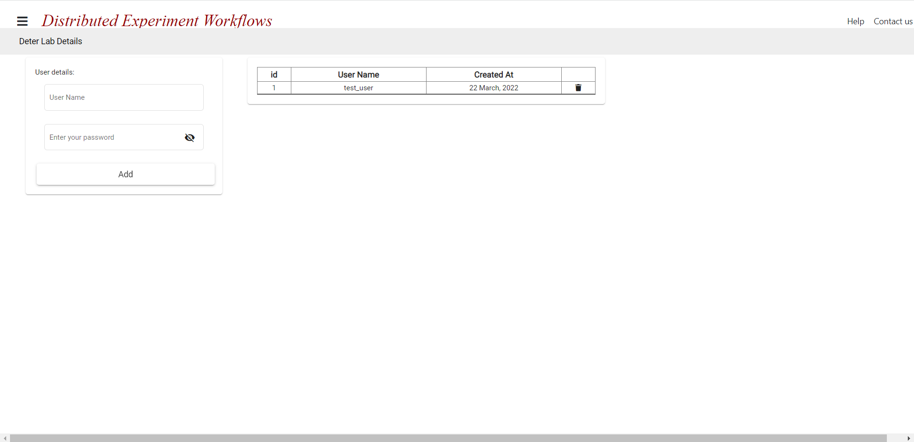

# Profile Page

The Profile Page is used to link Deterlab user accounts in order to run and monitor DEW experiments on Deterlab. The profile page is shown below:

## Linking a Deterlab User Account

You can link Deterlab user accounts to your DEW profile by entering the **Deterlab Username and Password** in the respective fields of the `User Details Form` (shown on the upper-left portion of the screen).

Once you link a Deterlab account, it will be added to the table shown in the right portion of the screen.

The linked Deterlab accounts can be used to run and monitor DEW experiments on Deterlab.