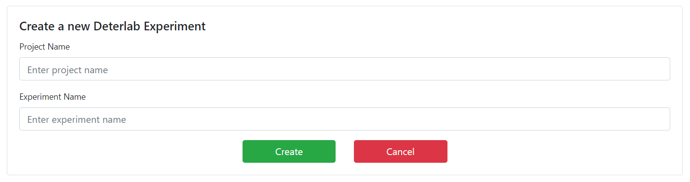

# Testbed Page
The Testbed page can be accessed from the Menu bar under the `Run` option on the Experiment Page. This page can be used to run the corresponding DEW experiment on any testbed and get the real-time status of the experiment.

## Pre-requisites
Prior to running an experiment, make sure to add your testbed profile at the [Profile Page](https://dew.isi.edu/profile/accounts) which can be found in the Side-Navigation Panel on the Dashboard page.

## Run DEW experiment on Testbed
In order to run your DEW experiment on a testbed, make sure you've done the following prior to running the experiment:

1. You've written syntactically and logically correct _Scenarios_ and _Constraints_.
2. You've defined the _Bindings_ for all your actions and events.
3. You don't have any dependency cycles.
4. You've added the respective testbed profile at the _Profile Page_ (as mentioned in the pre-requisites).

Once you've done the above, there are two ways you can run your experiment on your testbed:

1. Manually exporting your _NS_ and _BASH_ file, and then uploading these files to generate an experiment on your testbed.
2. Using the Testbed page to automatically run your experiment and get real-time graphical updates of your experiment.

The **Testbed Page** is used to implement the 2nd approach stated above. 

## The Testbed Page

As soon as you land on the Testbed page, you'll be presented with an empty screen with a few tabs and buttons.

On the upper-right portion of the screen, you'll find the `Choose Profile` dropdown menu that would enable you to select the corresponding testbed profile you want to use for the current experiment (The Testbed profiles need to be added in the _Profile Page_).

The `Choose Profile` dropdown is shown below.

Below this dropdown, you will find two buttons as shown below.

Selecting either of the buttons would allow you to do one of the following things:

* `Link an Existing Experiment` - This option allows you to link your DEW experiment with an already existing Testbed experiment (as long as the Testbed experiment is under the selected Testbed profile). You will have to ensure that the network topology on the Testbed experiment is the same as the one defined in the DEW experiment. If not, you might face errors while running the experiment. The menu to link an existing experiment is shown below.

    

    The _Project Name_ and _Experiment Name_ fields are used to enter the names of the Testbed _project_ and _experiment_ you want to link to the current DEW experiment.

    Upon clicking `Link`, your Testbed experiment will get linked to your current DEW experiment.
      

* `Create a new Testbed Experiment` - This option allows you to create a new Testbed experiment with your own _Project Name_ and _Experiement Name_ as shown below.

    

    Upon clicking `Create`, a new Testbed experiment will be created under the selected profile with the appropriate _NS_ and _BASH_ files loaded into the Testbed experiment. (The _NS_ and _BASH_ files will be generated from your DEW Scenarios, Constraints, and Bindings).

## Running the DEW experiment

Once you've created/linked your DEW experiment, you will see the following options towards the right of the screen.

The `Project Name` and `Experiment Name` denote the name of the Testbed project and experiment.

The `Status` denotes the current status of the experiment in Testbed.

The various buttons and their functionalities are described below:

* `Refresh` - This button is used to manually refresh the status of the experiment. (Please note that the experiment will be refreshed automatically at regular intervals. Use this button only if you want to manually force refresh the status of the experiment.)
* `Swap In Experiment` - This button is used to swap in the Testbed experiment.
* `Update Mapping` - This button is used to link the current DEW experiment to a different Testbed experiment.
* `Delete Mapping` - This button is used to unlink the currently linked Testbed experiment.
* `Update NS File` - This button is used to reflect the updated Network Topology (as specified by the DEW Scenario and Constraints) on the Testbed experiment.

Once you swap in your experiment, you'll find the status updated as _in transition_. This indicates that your experiment is in the process of being swapped in on Testbed.

Once your experiment has been swapped in, the status will be updated as _active_ and you'll be able to run the experiment (as specified by the DEW Scenario and Bindings) on Testbed. You'll find the following buttons as shown below.

* `Swap Out Experiment` - This button will allow you to swap out your experiment from Testbed.
* `Run Experiment` - This button will allow you to run your experiment (as specified by the DEW Scenario and Bindings) on Testbed.

When you click on `Run Experiment`, you'll be given the option to select your run variables (that you've specified in the DEW _Scenario_). Select the appropriate run variable and click on `Run` to run your appropriate experiment script on Testbed.

It might take a few minutes before your experiment updates are reflected on the screen.

## Monitoring your DEW Experiment

* You can monitor your experiment by navigating to the `Run Logs` or `Current` tab.

* The `Run Logs` tab allows you to check the status of each action at every node. On the _Run Logs_ screen, you can select the experiment instance using the dropdown, and click `Show Details` to display the logs for that instance.

* The `Current` tab allows you to view the status of the experiment as a graph, where the nodes denote the _actions_, and the icons towards the right of each node denotes the number of nodes (nodes to which the action is assigned to) in the _completed_, _failed_, _running_, and _waiting_ phases (the order of the phases mentioned reflect the actual order of icons).

    A representation of a sample experiment and the _phase icons_ are shown below.

    

    Clicking on an _action node_ will display the status of the action (the run logs) towards the right of the screen as shown below.

    
      

* Once you're finished with the experiment, you can click on `Stop Experiment` towards the right of your screen in order to stop the current experiment.

## Tutorials
View video tutorials on using the testbed page below:  
<iframe width="560" height="315" src="https://www.youtube.com/embed/AH4rYIfsRCQ" frameborder="0" allow="accelerometer; autoplay; clipboard-write; encrypted-media; gyroscope; picture-in-picture" allowfullscreen></iframe>
 